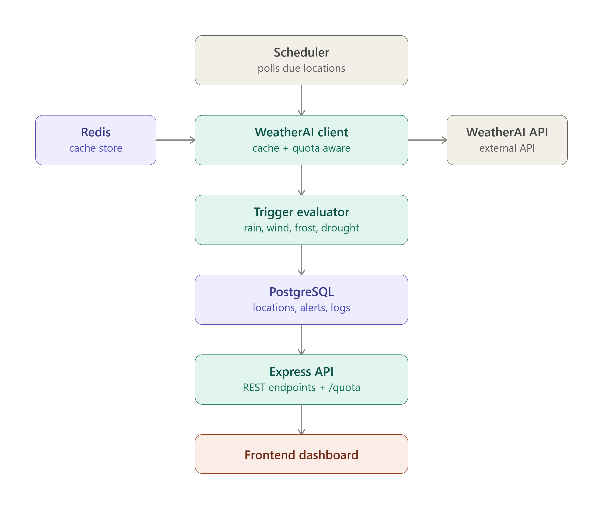

# WeatherAI Alert Hub

A quota-aware weather trigger engine built on the [WeatherAI API](https://weather-ai.co/docs). It polls current conditions across multiple locations, evaluates rain/wind/frost/drought trigger conditions, and does all of it while staying inside the Free tier's 1,000 requests/month cap, no Pro-tier Webhooks access required.

## Why this exists

WeatherAI's own Webhooks feature (subscribe a URL, get a POST when rain/wind/frost/drought conditions are met) is gated behind the Pro plan. This project reimplements that same trigger-based alerting model on the Free tier, using scheduled polling instead of push webhooks, and is built around a constraint the Free tier makes unavoidable: **you cannot poll every location every few minutes and expect to survive a 1,000 req/month budget.**

So instead of polling naively, the backend:

- **Caches** every weather response in Redis, keyed by rounded coordinates and units, with a configurable TTL (default 25 minutes), so repeated polls of the same location within that window cost zero API calls.
- **Tracks quota** by self-counting requests in Redis against `WEATHERAI_MONTHLY_LIMIT` (the Free tier's documented cap), and refuses to issue new requests once remaining quota drops within a configurable safety buffer. The WeatherAI Free tier returns no `X-RateLimit-*` headers, so header-based tracking is kept as a defensive fallback only.
- **Backs off** with exponential retry on `429`/`500`/`502`/`503`/`504` responses instead of hammering the API when it's rate-limited or briefly unavailable.
- **Spaces out polls per location** with a minimum interval, so adding more monitored locations degrades gracefully (fewer polls per location) instead of silently exhausting the monthly quota.

The result: you can monitor a realistic number of locations on a $0 plan without hitting `429`s, and the code makes that design decision visible rather than hiding it.

## Architecture



**Data flow:** the scheduler wakes up every `SCHEDULER_TICK_SECONDS`, finds locations due for a poll (respecting `MIN_POLL_INTERVAL_SECONDS` per location), asks the WeatherAI client for current conditions (which serves from cache when possible and checks quota headroom before hitting the network), runs the result through the trigger evaluator against each location's configured trigger types, writes any matches to `AlertEvent`, saves the full weather snapshot to `PollLog` for visibility into current conditions, and logs the poll outcome for auditability.

## Tech stack

| Layer | Choice | Why |
|---|---|---|
| Runtime | Node.js + TypeScript | Type safety on the parts that matter most: header parsing, quota math, trigger logic |
| API framework | Express | Small surface area, no framework overhead to explain in an assessment |
| Database | PostgreSQL via Prisma | Typed queries, migrations, fast to iterate under time pressure |
| Cache / state | Redis via ioredis | Weather response cache + quota state, both need TTL/atomic behavior a DB doesn't give cheaply |
| Scheduling | node-cron | In-process polling, no external job infra needed for this scope |
| Validation | Zod | Fails fast on bad env config or malformed request bodies |
| Testing | Vitest + ioredis-mock + supertest | Redis-dependent logic tested without a live Redis instance |
| Frontend | Next.js | Dashboard: locations, live status, trigger config, alert history, current conditions |

## Getting started

### Prerequisites

- Node.js 20+
- Docker (for local Postgres + Redis), or your own instances
- A free WeatherAI API key from [weather-ai.co](https://weather-ai.co)

### 1. Clone and install

```bash
git clone https://github.com/littlegod20/weatherai-alert-hub.git
cd weatherai-alert-hub/backend
npm install
```

### 2. Start Postgres and Redis

```bash
docker run -d --name weatherai-pg -e POSTGRES_PASSWORD=postgres -e POSTGRES_DB=weatherai_alert_hub -p 5432:5432 postgres:16
docker run -d --name weatherai-redis -p 6379:6379 redis:7
```

### 3. Configure environment

```bash
cp .env.example .env
```

Fill in `WEATHERAI_API_KEY` with your key from the WeatherAI dashboard. Defaults for everything else are safe for local development.

| Variable | Purpose |
|---|---|
| `WEATHERAI_API_KEY` | Your Bearer token, `wai_...` |
| `WEATHERAI_BASE_URL` | Defaults to `https://api.weather-ai.co` |
| `WEATHERAI_MONTHLY_LIMIT` | Your plan's monthly request cap (Free tier: 1000) |
| `DATABASE_URL` | Postgres connection string |
| `REDIS_URL` | Redis connection string |
| `SCHEDULER_TICK_SECONDS` | How often the scheduler checks for due polls |
| `MIN_POLL_INTERVAL_SECONDS` | Minimum gap between two polls of the same location |
| `WEATHER_CACHE_TTL_SECONDS` | How long a cached weather response is served before re-fetching |
| `QUOTA_SAFETY_BUFFER` | Stop issuing new requests once remaining quota drops below this |

### 4. Run migrations

```bash
npx prisma generate
npx prisma migrate deploy
```

Use `migrate deploy` for production and CI. Use `migrate dev` during local development when you want Prisma to also regenerate the client automatically.

### 5. Run it

```bash
npm run dev       # backend, http://localhost:4000
```

Frontend:

```bash
cd ../frontend
npm install
npm run dev        # http://localhost:3000
```

### 6. Run tests

```bash
npm test
```

## API

| Method | Endpoint | Description |
|---|---|---|
| `POST` | `/locations` | Register a location with lat/lon, units, and trigger types to watch |
| `GET` | `/locations` | List registered locations and their current status |
| `GET` | `/locations/:id` | Get one location, including the latest poll snapshot (current conditions) |
| `PATCH` | `/locations/:id` | Update trigger config, units, or active status |
| `DELETE` | `/locations/:id` | Stop monitoring a location |
| `GET` | `/locations/:id/alerts` | Alert history for a location |
| `GET` | `/quota` | Current known WeatherAI quota state (limit, remaining, reset time) |
| `GET` | `/health` | Liveness check |

## Project status

- [x] Env config, Prisma schema, Redis client, weather cache, quota tracker (tested)
- [x] WeatherAI HTTP client with retry/backoff
- [x] Trigger evaluator (rain/wind/frost/drought)
- [x] Scheduler
- [x] Express routes
- [x] Frontend dashboard with current conditions card and alert history
- [x] Deployment

## Deployment

Backend: Railway (Postgres + Redis add-ons). Frontend: Vercel.

- **Frontend:** https://weather-ai-alert-hub.vercel.app
- **Backend API:** https://weather-ai-alert-hub-production.up.railway.app

## License

MIT
